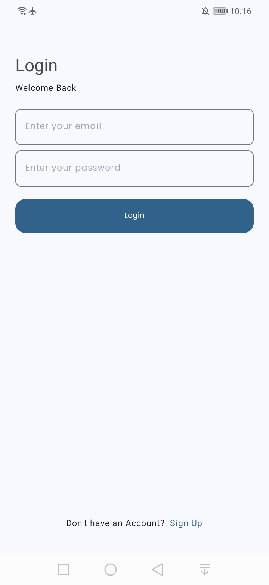
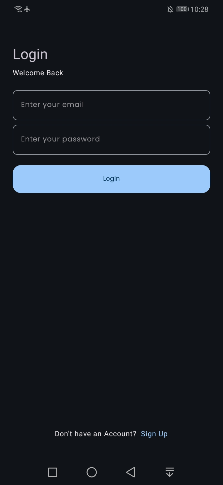
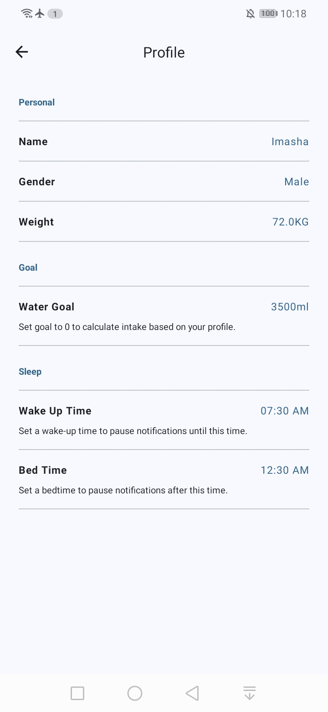
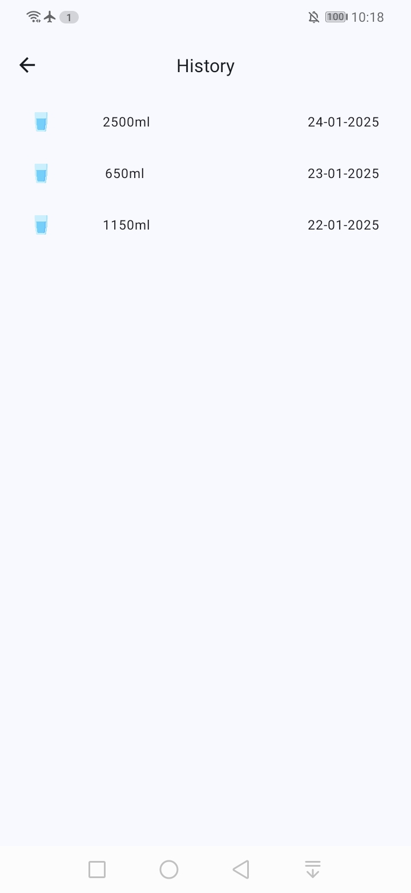

<h1> Hydrate Me </h1>

<h3 align="center" style="color:red; border:none">🚧 This project is currently under development. 🚧 </h3>  

A <strong> Water Reminder </strong> app that helps you stay hydrated throughout the day. Built with Kotlin, MVVM architecture, and Firebase to track and meet your hydration goals.

<h2> ⚙️ Technologies </h2>
<ul>
  <li>Kotlin with MVVM Architecture.</li>
  <li>Jetpack libraries, including ViewModel, LiveData, Data Binding.</li>
  <li>Firebase Authentication, Firestore and Cloud Messaging.</li>
  <li>Dependency injection using Hilt.</li>
  <li>Material 3 design.</li>
</ul>

<h2> 🔥 Features </h2>
<ul>
  <li>Track daily water consumption.</li>
  <li>Reminds to drink water with notifications.</li>
  <li>Calculate daily water intake based on profile.</li>
  <li>Switch between multiple languages.</li>
  <li>Select your preferred theme.</li>
</ul>
  
<h2> 📸 Screenshots </h2>

 

 

 

 

 

 

 

 

<h2> 👽 Author </h2>
<a href="https://www.imashasenarath.com/" target="_blank"><strong>Imasha Senarath</strong></a>