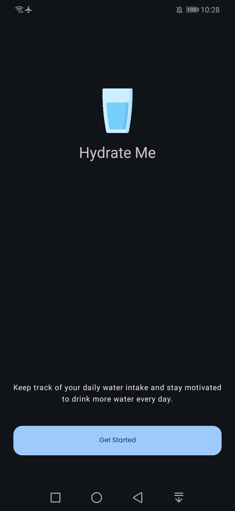
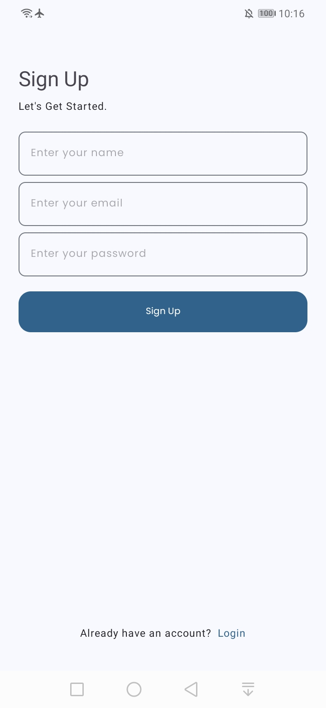
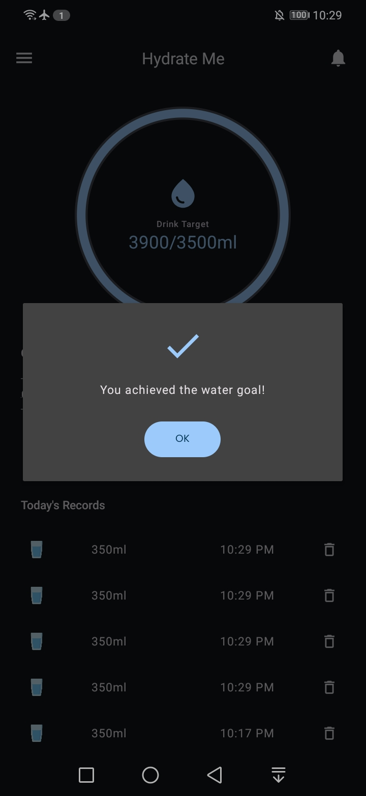

<h1> Hydrate Me </h1>

A water reminder app that helps you stay hydrated throughout the day. Built with Kotlin, MVVM Clean Architecture, and Firebase to track and meet your hydration goals.

<h2> ⚙️ Technologies </h2>
<ul>
  <li>Kotlin with MVVM and Clean Architectures.</li>
  <li>Jetpack libraries, including ViewModel, LiveData, Data Binding, WorkManager.</li>
  <li>Firebase Authentication, Firestore and Cloud Messaging.</li>
  <li>Dependency injection using Hilt.</li>
  <li>Material 3 design.</li>
  <li>Retrofit to simplify RESTful API calls.</li>
  <li>CircularProgressBar by Lopez Mikhael.</li>
  <li>Enhance performance with data caching using the Room database.</li>
</ul>

<h2> 🔥 Features </h2>
<ul>
  <li>Track daily water consumption.</li>
  <li>Reminds to drink water with notifications.</li>
  <li>Calculate daily water intake based on profile.</li>
  <li>Syncs data online, allowing access from any device.</li>
  <li>Switch between multiple languages.</li>
  <li>Switch between light and dark themes.</li>
  <li>Receive random advice about the benefits of staying hydrated.</li>
</ul>

<h2>🛢️ Set Up Database</h2>

This project uses Firebase, but the current Firebase account has been disabled due to spamming, so the app won’t work. To make it functional, create a new Firebase project, add the Android app, and generate the google-services.json file. Place it in the app/directory. Then, enable Email Authentication and Firestore Database in your Firebase project.

  
<h2> 📸 Screenshots </h2>

 

 

 

 

 

 

 

 

To see all screenshots, check the "ss" folder.

<h2> 👽 Author </h2>
<a href="https://www.imashasenarath.com/" target="_blank"><strong>Imasha Senarath</strong></a>

<h2> © Credits </h2>

All icons, images, and other media used in this project are the property of their respective copyright owners. Their rights are fully acknowledged and respected.
